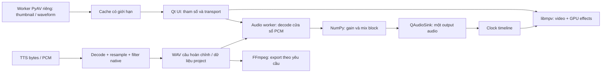

# Thiết kế pipeline media trực tiếp trong RAM/GPU

Ngày: 2026-09-12. Trạng thái: thiết kế đề xuất để thực thi theo kế hoạch đi kèm; chưa triển khai.

## Mục tiêu và phạm vi

Thao tác volume, mute, seek, chỉnh màu và mở timeline không phải chờ `ffmpeg.exe` tạo file media rồi nạp lại. Dùng thư viện native đã có: libmpv, PyAV, SoundFile, NumPy và Qt Multimedia. Hiệu năng được nghiệm thu trên đường đi từ thao tác đến âm thanh/hình ảnh, không suy ra từ việc đã dùng DLL.

Phạm vi gồm audio preview TTS + Music + original, scrubbing, conversion/hậu xử lý câu TTS, thumbnail và waveform ở cả launcher/editor, GPU color/LUT preview và đóng gói Windows. Giữ định dạng project và khả năng mở project cũ.

Giữ FFmpeg CLI cho Final Export, Fast Preview render mẫu theo yêu cầu, đường tương thích chưa chuyển đổi và các workflow AI offline ngoài phạm vi. Không thay inference backend AI, không thêm nội suy frame/optical flow, không xây trình xuất video bằng PyAV trong đợt này. Tốc độ phát hiện có phải hoạt động đúng; chỉnh speed riêng từng clip là tính năng riêng.

## Những gì đã xác minh trong source

| Luồng | Hiện trạng | Chỗ cần đổi |
| --- | --- | --- |
| LUT | `gpu-next`, native `lut` đã có | `CubeLutCache.blended_path()` còn sinh `.cube` khi đổi strength |
| Chỉnh màu | `_realtime_color_graph()` tạo `eq/hue/colorbalance/curves` qua lavfi trong mpv | Giảm rebuild filter, chuyển GPU khi giữ được thứ tự hiệu ứng |
| Freeze | `freeze_video_frame()` và `TimeWarpService` đã có | Tích hợp clock audio mới; không xây lại tính năng |
| Volume | Original/TTS đơn phát qua Qt; TTS + Music tạo WAV | `_resolve_preview_mixed_audio_path()` được gọi đồng bộ sau timer 120ms |
| Mixer | `mix_audio_tracks()` đã dùng NumPy | Đọc theo cửa sổ, trộn block và phát PCM; không trộn toàn timeline khi đổi gain |
| TTS | Edge/CapCut decode từng MP3 bằng CLI; speed/fit/trim tiếp tục tạo file | Decode/filter trong process; giữ WAV kết quả ở biên lưu project |
| Visuals | Worker editor và launcher đều có extraction bằng CLI | Một đường decode dùng chung, không chặn mở editor |
| Export | NVENC hoặc libx264 | Giữ encode/mux hiện tại, đồng nhất cách áp volume |

Môi trường đã kiểm tra: PySide6 6.11.2, PyAV 18.1.0, SoundFile 0.14.0 / libsndfile 1.2.2 có MP3; PyAV có `atempo`. Đây là phiên bản quan sát được, không tự động là version floor của bản phát hành. `av` đang có gián tiếp; khi code dùng trực tiếp phải khai báo dependency trực tiếp và kiểm tra bundle.

## Lựa chọn kiến trúc

1. **Chọn: chuyển từng luồng sang thư viện native, giữ backend tương thích trong thời gian chuyển đổi.** Tận dụng code hiện có, mỗi giai đoạn đo được và bàn giao riêng.
2. Dồn cả audio vào mpv: ít Python hơn nhưng source ghi nhận giới hạn `audio-add`/audio filters của bundle; không chọn làm nền tảng khi chưa có bằng chứng hỗ trợ.
3. Viết C++ engine mới và thay cả export: phạm vi lớn, phát sinh ABI/build/deploy; không cần để đạt phản hồi tốt ở preview.

## Ràng buộc chung

- Windows 10/11; giữ Python 3.11 chạy từ source.
- Không thêm miniaudio, custom C++ DLL, framework task queue hoặc framework test mới.
- UI thread không decode media, trộn toàn track, sinh LUT lớn, chờ worker hoặc chờ subprocess.
- Mỗi decoder/container chỉ do một worker sở hữu; không chia sẻ PyAV container giữa audio và thumbnail.
- Audio dùng một output và một clock timeline; không để hai backend audio phát đồng thời.
- PCM cache tối đa 128 MiB; thumbnail cache tối đa 32 MiB, tính cả bản sao ảnh do UI giữ; queue tối đa 8 block audio. Đây là ngân sách buffer do ứng dụng quản lý, không phải giới hạn RSS toàn process.
- PCM nội bộ ban đầu giữ 16 kHz mono float32 để tương thích mixer hiện tại; output được resample theo format thiết bị. Nâng chất lượng stereo/48 kHz nội bộ là thay đổi riêng.
- File media nguồn được đọc theo nhu cầu. WAV câu TTS hoàn chỉnh, project và cache nhỏ có ích vẫn được lưu; không đặt mục tiêu SSD chỉ đọc một lần.
- Tác vụ media trả kết quả kèm generation ID; kết quả thuộc project/seek cũ bị loại. Đóng project phải đóng decoder, ngừng audio và giải phóng cache.
- Chỉ bật backend mới mặc định sau khi qua kiểm thử đúng chức năng và bundle. Fallback phải ghi lý do, không âm thầm công bố đã đạt đường native.

## Audio và thời gian

Audio worker giữ PCM chưa áp gain trong cache, trộn block 160 sample (10ms ở 16kHz), áp gain gần thời điểm đưa vào output. Decode có thể đi trước 0,5 giây nhưng không queue 0,5 giây audio đã trộn. Output buffer mục tiêu khoảng 40ms, điều chỉnh theo format và buffer thực tế của thiết bị.

Track tiếp tục dùng `path`, `start`, `end`, `source_start`, `volume`, `muted`, `loop`; bổ sung ID ổn định lấy từ layer và `time_domain` cho snapshot runtime: `media` với original, `timeline` với TTS/music. Không lưu các buffer/runtime ID vào project. Trường mute/gain/fade của UI phải được tổng hợp thành snapshot đầy đủ.

Clock timeline lấy từ lượng audio Qt đã xử lý cộng mốc seek, có hiệu chỉnh độ trễ được đo. `processedUSecs()` là ước lượng của backend, không coi là timestamp chính xác tại loa. Khi không có output device dùng clock monotonic có pause/resume; khi thiếu dữ liệu do decode chậm thì rebuffer và tạm giữ transport thay vì chạy timeline vượt audio. Silence do track trống là nội dung hợp lệ và vẫn tiến clock.

Freeze giữ frame nguồn; original im lặng trong khoảng chèn, TTS/music tiếp tục. Hết freeze tiếp tục original từ điểm nguồn đúng; không áp warp lần hai cho file preview đã render warp. Tái sử dụng `TimeWarpService`. `position()`/`positionChanged` cũ vẫn là tọa độ media; thêm `timeline_position_ms()` và signal riêng để UI không phải ánh xạ ngược một frame freeze thành thời gian duy nhất.

Playback speed đổi cả tiêu thụ audio và video. Dùng native `atempo` cho thay tốc độ giữ pitch; clock phải tích lũy từng đoạn tốc độ, không lấy toàn bộ thời gian đã phát nhân tốc độ mới. Seek reset queue/resampler/tempo state và bỏ kết quả cũ.

**Quyết định cần hiển thị rõ khi review audio:** mixer cũ normalize theo peak toàn track. Cách đó phụ thuộc dữ liệu tương lai nên không thể giữ nguyên mà vẫn thay gain tức thì không quét toàn bài. Kế hoạch chọn cộng gain tuyến tính và giới hạn biên bằng `np.clip` ở output, áp cùng quy tắc cho timeline export. Có ramp gain 5ms để tránh click. Overload sẽ bị cắt đỉnh, không tự nâng âm lượng đoạn nhỏ. Đây là thay đổi hành vi audio có chủ đích, cần nghe A/B và ghi release note; không đổi các hàm normalize giọng TTS không liên quan.

## Thumbnail, waveform, TTS và màu

Thumbnail dùng PyAV worker riêng, seek theo time base/PTS, scale trước khi tạo ảnh. Worker trả `QImage` sở hữu buffer; GUI tạo `QPixmap`. Hủy/đổi video không giữ buffer của project cũ. Launcher hiển thị placeholder rồi cập nhật card, không đợi toàn bộ thumbnail/waveform mới mở editor. Có thể đọc cache JPG cũ, nhưng đường mới không sinh một JPG cho mỗi thumbnail.

Waveform decode theo block, tích lũy max/sum-of-squares/count theo bucket và chuẩn hóa bằng global peak ở cuối để giữ hình dạng hiện có. Cache peaks nhỏ được ghi atomically theo source path/size/mtime, stream và phiên bản thuật toán. Không giữ PCM toàn video. Giữ giới hạn độ dài hiện có cho đến khi benchmark xác nhận bỏ giới hạn không gây tranh tài nguyên.

TTS chuyển từng bước: thay MP3 conversion trước, sau đó chuyển speed/fit/trim sang cùng vòng đời PCM cho mỗi câu. Chỉ serialize WAV khi một câu hoàn chỉnh cần được lưu hoặc đưa qua adapter cũ; không bắt buộc giữ 200 câu trong RAM. Flush decoder/resampler/filter tại EOF, giữ chính sách retry/cancel và không đánh dấu artifact hoàn thành khi chỉ ghi được một phần.

GPU giữ công thức và thứ tự `color -> blur/mask -> LUT` của preview/export. Không đặt shader màu sau lavfi blur/mask rồi gọi là tương đương. Bắt đầu với color/LUT độc lập; sau đó giải quyết shader stages cho blur/mask đang hỗ trợ và so sánh đúng thứ tự. Nếu một tổ hợp chưa qua kiểm tra, giữ đường lavfi in-process và đánh dấu tổ hợp đó chưa hoàn thành chuyển GPU. HDR/color management phải được kiểm tra riêng; SDR trước, không đổi mặc định HDR dựa vào suy đoán.

LUT strength nên là tham số shader với LUT upload một lần; không sinh `.cube` theo từng nấc slider. Kiểm chứng API shader parameters trên DLL thực tế trước khi triển khai; không coi tài liệu mpv mới nhất là bằng chứng DLL đã hỗ trợ. Parse `.cube` phải xử lý TITLE/comment/domain, trật tự R/G/B, sai kích thước và dữ liệu không hữu hạn.

## Nghiệm thu

Các số dưới là mục tiêu ban đầu, không phải kết quả đã đo. Giai đoạn baseline ghi CPU/GPU/RAM, ổ đĩa, codec, resolution, GOP, thời lượng và thiết bị audio; báo riêng cold/warm cache.

| Chỉ tiêu | Mục tiêu trên bộ mẫu baseline |
| --- | --- |
| UI event handler p95 | <= 16ms; không có đoạn xử lý media đồng bộ > 50ms |
| Volume -> audio thay đổi | p95 <= 100ms sau khi playback đã ổn định |
| Thay gain/mute | 0 process FFmpeg/ffprobe và 0 file media mới trên native path |
| Audio/video lệch khi phát ổn định | <= 40ms, không tích lũy drift sau 10 phút; đo loopback/click-flash |
| Kéo seek | Không tích hàng đợi; gửi tối đa khoảng 30 seek/giây |
| Thả seek | Frame cuối đúng PTS; đo p95 theo từng codec/GOP, không đặt cam kết 0ms |
| Color/LUT đã warm | p95 phản hồi hình <= 50ms trên máy benchmark hỗ trợ; không sinh file theo slider |
| Mở project | Editor không chờ toàn bộ visuals; kết quả hiện dần |
| Conversion/TTS visuals | 0 subprocess trên đường đã chuyển; đo thời gian toàn bước và đếm file trung gian |
| RAM/cleanup | Buffer tuân ngân sách; không tăng theo toàn bộ thời lượng; 20 vòng mở/đóng không tăng tài nguyên liên tục |

Các ca bắt buộc: video 1/10/60 phút, một mẫu 4 giờ cho memory; H.264, HEVC, VFR, long-GOP; no-audio; 1/3/8 track; offset/loop/fade/mute; 200 câu TTS; Unicode paths; seek vào/ra freeze; đổi speed đang phát; xuất video lúc preview mở; máy không NVIDIA; thiếu/hỏng DLL.

## Nguồn API đã kiểm tra

- [Qt QAudioSink](https://doc.qt.io/qt-6/qaudiosink.html): output PCM, buffer và thời gian xử lý.
- [PyAV audio](https://pyav.org/docs/stable/api/audio.html): resampler/FIFO; kiểm tra lại bằng API 18.1.0 cài local khi code.
- [PyAV containers](https://pyav.org/docs/stable/api/container.html): decode và seek theo time base.
- [SoundFile](https://python-soundfile.readthedocs.io/en/0.13.1/): virtual I/O và block processing.
- [mpv manual](https://mpv.io/manual/stable/): seek flags, hwdec, shader options và native LUT; probe DLL bundle là bước bắt buộc.
